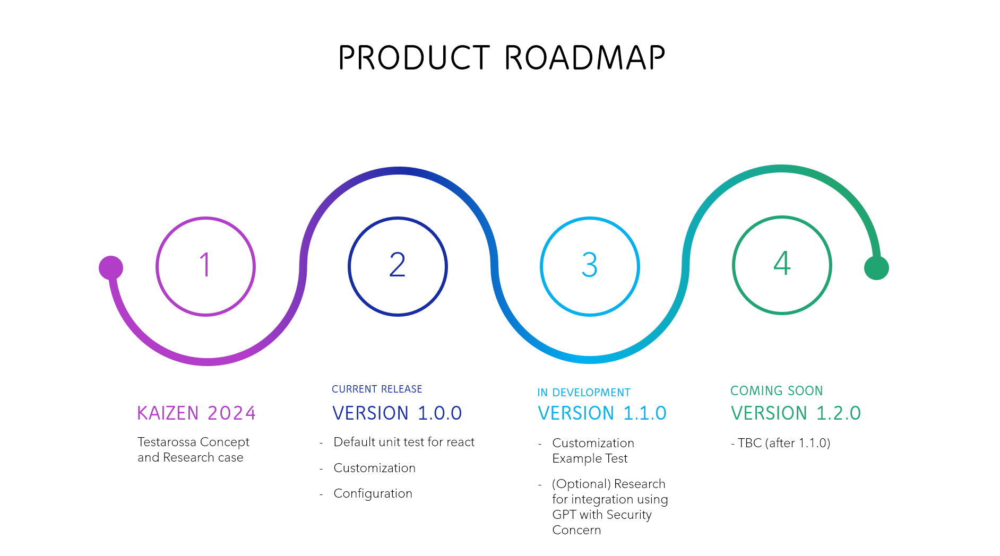

# Testarossa
All you can do for unit testing

# Main Features
generate all component files that will be created and given the default content that will be written

## Full Documentation
For full documentation, please visit [Testarossa Documentation](https://testarossa-docs.vercel.app/)

## Issues
if any issues, you can create issue in this repository [Create Issues](https://github.com/ZiddanDwiPutra/testarossa/issues)

# Roadmap

# Creator
Email
- [Ziddan Dwi Putra](mailto:ziddandwiputra21@gmail.com)

Telegram
- username @ziddandputra

